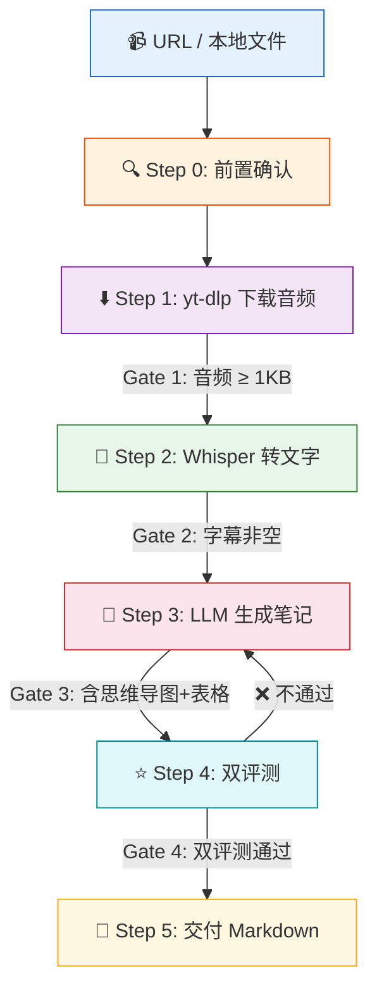

# Video to Notes — 视频转学习笔记

将任意视频或音频自动转换为结构化、可复习的学习笔记。

支持 B站、YouTube、抖音、小红书、播客等平台。使用 yt-dlp 下载音频，Whisper 语音转文字，再经 LLM 分析生成带思维导图、对比表格、选择指南、知识提炼的专业笔记。

## 功能特性

- **全自动 6 Step 工作流** — 前置确认 → 下载 → 转写 → 生成 → 评测 → 交付
- **Inversion 模式** — 先确认需求再开工，不做无用功
- **智能模型适配** — 根据视频时长自动选择 Whisper 模型（tiny → large）
- **双评测体系** — 确定性评测（7 项硬检查）+ Rubric 评测（4 维度质量评分）
- **门控机制** — 每一阶段都有门控检查，不过关不往下走
- **Markdown 输出** — 默认生成 `.md` 文件，PDF/Word 可借助 pandoc 自行转换

## 安装

```bash
# 克隆到 OpenCode skills 目录
git clone https://github.com/bjkjy/video-to-notes.git ~/.opencode/skills/video-to-notes
```

如果使用 `opencode.json` 配置文件，添加如下引用：

```json
{
  "skills": {
    "video-to-notes": {
      "name": "video-to-notes",
      "description": "将视频/音频自动转换为结构化学习笔记",
      "path": "~/.opencode/skills/video-to-notes"
    }
  }
}
```

> 部分 Agent 实现会自动扫描 `~/.opencode/skills/` 目录，克隆即可用，无需配置。

## 依赖安装

```bash
# yt-dlp — 下载音频
pip install yt-dlp --break-system-packages

# openai-whisper — 语音转文字
pip install openai-whisper --break-system-packages
```

检查依赖：

```bash
bash scripts/check-deps.sh
```

## 使用方式

给 Agent 发送以下任意一条指令即可触发：

> - "帮我把这个视频转成学习笔记 https://www.bilibili.com/video/BV1xx..."
> - "把这个 YouTube 视频转成笔记 https://youtu.be/xxx"
> - "总结这个视频并生成学习笔记 https://..."

Agent 会自动执行：**前置确认 → 下载音频 → 转文字 → 生成结构化笔记 → 质量评测 → 交付**。

你只需在确认页回复 `Y`，其余全自动。

## 工作流概览



每个阶段有严格的门控检查，不过关自动回退，确保输出质量。

## 内置脚本与评测

| 路径 | 用途 |
|------|------|
| `scripts/check-deps.sh` | 运行时依赖检查 |
| `evals/deterministic_grader.py` | 确定性评测（7 项硬性检查） |
| `evals/rubric_grader.py` | Rubric 评测（4 维度评分） |
| `references/yt-dlp-cheatsheet.md` | yt-dlp 参数速查 |

## 输出示例

生成的笔记包含：

- 思维导图（Mermaid/ASCII）
- 章节化知识点
- 对比表格与复杂度分析
- 选择指南 / 决策树
- 知识提炼 / Q&A
- 核心要点总结

## 兼容性

### 输入平台

B站、YouTube、抖音、小红书、播客等 yt-dlp 支持的所有平台

### 输入格式

视频：`.mp4` `.mkv` `.mov` `.webm` `.avi`
音频：`.mp3` `.wav` `.m4a` `.flac` `.ogg`

## 同类 Skill 对比

| 维度 | **video-to-notes** | [video-transcript](https://github.com/openclaw/skills) | [faster-whisper](https://github.com/openclaw/skills) | [summarize](https://github.com/openclaw/openclaw) | [youtube-transcript](https://github.com/openclaw/skills) | [Video Processor](https://github.com/disler/claude-code-hooks-multi-agent-observability) |
|------|:---:|:---:|:---:|:---:|:---:|:---:|
| 视频下载 | ✅ yt-dlp | ❌ | ❌ | ❌ | ✅ yt-dlp | ✅ ffmpeg |
| 语音转文字 | ✅ Whisper | ❌ | ✅ faster-whisper | ❌ | ❌（字幕） | ✅ Whisper |
| **结构化笔记** | ✅ | ❌ | ❌ | ❌（摘要） | ❌ | ❌ |
| **思维导图** | ✅ | ❌ | ❌ | ❌ | ❌ | ❌ |
| **对比表格** | ✅ | ❌ | ❌ | ❌ | ❌ | ❌ |
| **选择指南** | ✅ | ❌ | ❌ | ❌ | ❌ | ❌ |
| **知识提炼** | ✅ | ❌ | ❌ | ❌ | ❌ | ❌ |
| **质量评测** | ✅ 双评测 | ❌ | ❌ | ❌ | ❌ | ❌ |
| **门控机制** | ✅ 5 道门控 | ❌ | ❌ | ❌ | ❌ | ❌ |
| Inversion 模式 | ✅ 先确认后执行 | ❌ | ❌ | ❌ | ❌ | ❌ |
| 输入平台 | B站/YouTube/抖音/播客等 | — | 本地音频 | URL/播客 | YouTube | 本地视频 |
| 输出 | Markdown | 文本/SRT | SRT/JSON | 摘要文本 | 字幕文本 | 文本/SRT |

> video-to-notes 是唯一覆盖 **完整流水线**（下载 → 转录 → 结构化笔记 → 质量评测 → 交付）的 Skill。

## 许可证

MIT
